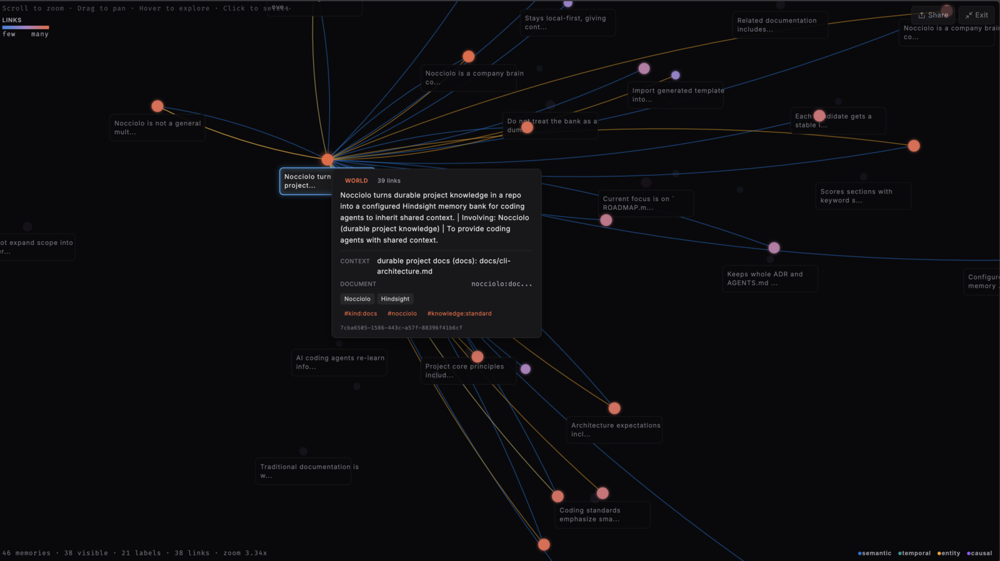

# Nocciolo


**Company brain config for AI agents.**

Nocciolo (Italian for kernel / core) — the durable core of project knowledge that agents inherit.

## Goal 

Seed Hindsight memory banks from durable project docs, ADRs, and decisions so agents inherit shared context instead of rediscovering it every session.

[](LICENSE)
[]()

---

## The Problem

AI coding agents start every session cold.

They re-learn architecture decisions, coding standards, domain invariants, and “why we built it this way” from scattered READMEs, ADRs, comments, and tribal knowledge. That wastes tokens, produces inconsistent output, and breaks long-running agentic workflows.

Traditional documentation is written for humans. Agent memory systems need structured, durable, queryable knowledge with clear missions and boundaries.

## The Vision

Nocciolo is the **company brain config** layer.

It turns the durable knowledge already living in your repository into a properly configured memory bank that agents can retain, recall, and reflect against — starting with [Hindsight](https://hindsight.vectorize.io).

Agents inherit shared context instead of rediscovering it.

## What Nocciolo Does

- **Scans** your project for durable knowledge (READMEs, ADRs, standards, domain docs, schemas)
- **Configures** a Hindsight memory bank with a clear mission, directives, and extraction settings tuned for software projects
- **Seeds** the bank with high-signal facts and decisions so agents start with real context
- **Emits** the configs and MCP snippets needed to wire the bank into Cursor, Claude Code, Roo, and other agent harnesses
- **Shares** knowledgebases across teams with explicit deployment profiles — local/LAN, VPN, or public — so the company brain reaches the agents that need it
- **Stays local-first** — you control the data and the hosting

Later versions will support additional memory backends, event-driven updates, richer curation tools, and team-wide bank sharing across deployment modes.

## Quick Start

```bash
# Once published
npx @nocciolo-ai/cli init              # scaffold .nocciolo/ config
npx @nocciolo-ai/cli configure         # generate Hindsight bank template
npx @nocciolo-ai/cli seed --dry-run    # preview candidates (no API calls)
npx @nocciolo-ai/cli seed              # retain (no auth)

# Developing this repo
pnpm install && pnpm build             # install deps and build the CLI
pnpm nocciolo init                     # scaffold .nocciolo/ config
pnpm nocciolo configure                # generate Hindsight bank template
pnpm nocciolo seed --dry-run           # preview candidates (no API calls)
pnpm nocciolo seed                     # retain (no auth)
```

When your Hindsight bank requires auth (typical for Docker with `HINDSIGHT_API_TENANT_API_KEY`), pass the **same secret value** into Nocciolo on live `seed` only — `--dry-run`, `init`, and `configure` do not need it:

```bash
# Published
NOCCIOLO_HINDSIGHT_API_KEY='your-actual-key' npx @nocciolo-ai/cli seed

# Developing this repo
NOCCIOLO_HINDSIGHT_API_KEY='your-actual-key' pnpm nocciolo seed

# Or export once for the shell session
export NOCCIOLO_HINDSIGHT_API_KEY='your-actual-key'
pnpm nocciolo seed

# Or pass the flag
pnpm nocciolo seed --api-key 'your-actual-key'

# Optional: read the key from a running Hindsight container
NOCCIOLO_HINDSIGHT_API_KEY="$(docker exec suchconfig-hindsight printenv HINDSIGHT_API_TENANT_API_KEY)" \
  pnpm nocciolo seed
```

Optional: put `nocciolo` on your PATH (`pnpm link --global` after `pnpm build`):

```bash
nocciolo seed --dry-run
NOCCIOLO_HINDSIGHT_API_KEY='your-actual-key' nocciolo seed
```

Requires Node.js 20+. Point at a custom Hindsight URL with `--hindsight-url`, `NOCCIOLO_HINDSIGHT_URL`, or `hindsightBaseUrl` in `.nocciolo/config.json`. `HINDSIGHT_API_KEY` is accepted as an alias for `NOCCIOLO_HINDSIGHT_API_KEY`.

The goal is a zero-to-useful bank in under five minutes.

## Seeding with `nocciolo seed`

`seed` is the heart of the workflow: curated retain into Hindsight — not a bulk markdown upload.

**Preview first**

```bash
pnpm nocciolo seed --dry-run
```

Shows scored candidates from durable docs (README, AGENTS.md, docs, ADRs), with provenance and skips for empty or low-signal sections. No API calls.

**Retain with clear progress**

```bash
NOCCIOLO_HINDSIGHT_API_KEY='your-key' pnpm nocciolo seed
```

Before retain starts you will see a warning like this — leave the terminal open until Nocciolo finishes:

```text
============================================================
Hindsight is processing retain requests.
Do not close this terminal or press Ctrl+C until Nocciolo reports completion.
Sync mode: 28 item(s); each can take several seconds. Progress shows as percent of items.
Interrupting mid-retain can leave a partial bank; re-run seed (use --force if needed).
============================================================
```

Then progress lines appear as each candidate is retained:

```text
Retaining 28 item(s) synchronously (LLM extraction per item).
Progress:
  [1/28] 0%  starting  nocciolo:README.md#the-problem
  [1/28] 4%  done      nocciolo:README.md#the-problem
  ...
```

A full first seed can take several minutes (LLM extraction per item). That is expected, not a hang.

- Uses stable `document_id`s so Hindsight **upserts** a document’s memories instead of dumping duplicate files into the bank
- Skips secrets and noise (`.env`, credentials, etc.) — see [sensitive data](./docs/sensitive-data.md)
- Auth failures stop early (pass `NOCCIOLO_HINDSIGHT_API_KEY` or `--api-key`)

**Re-seed only what changed**

Re-running `seed` hashes sources against `.nocciolo/local/seed-manifest.json`. Unchanged files are skipped; changed sections are re-retained. The bank is not wiped. Use `--force` to re-send everything.

```bash
pnpm nocciolo seed --dry-run          # see what would update
pnpm nocciolo seed                    # incremental retain
pnpm nocciolo seed --force            # re-retain all current candidates
pnpm nocciolo seed --async            # submit + poll Hindsight operation progress
```

After retain, Hindsight may still run **consolidation** in the background (observations / mental models). That is expected and usually much faster than old file-sync workflows.

Here is the Nocciolo bank’s world-facts constellation in Hindsight after a `seed` — structured memories and links agents can recall, not a dump of raw markdown files:



More detail: [developer workflow](./docs/dev-workflow.md).

## Docs

- [CLI architecture](./docs/cli-architecture.md) — module boundaries, seed pipeline, config, and env/auth for contributors
- [Developer workflow](./docs/dev-workflow.md) — build, first seed, re-seed, and Hindsight retain/consolidation tips
- [Sensitive data](./docs/sensitive-data.md) — allowlist/denylist decisions so secrets never get retained

## Core Principles

- **Durable over ephemeral** — only knowledge that should outlive a single session or model change
- **Local control** — self-hostable, version-controlled, no forced cloud dependency
- **Agent-native** — missions, directives, and structure that map cleanly to how modern memory systems actually work
- **Traditional craft first** — clear architecture, ADRs, and standards remain the source of truth; Nocciolo amplifies them for agents
- **Progressive** — start simple (single bank, one project), grow into multi-bank, multi-repo, team sharing, and event-driven workflows
- **Share on your terms** — deploy the bank locally or on a LAN, behind a VPN for private teams, or publicly when the knowledge is meant to be open

## Status

Nocciolo is in the earliest public stage. We are building in the open.

See [ROADMAP.md](./ROADMAP.md) for the high-level phased plan.

## Contributing

Issues, ideas, and PRs are welcome once the foundation lands. For now the best way to help is feedback on the vision and the initial CLI surface.

## License

MIT

