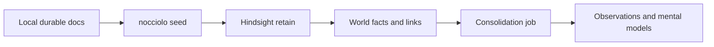

# Developer workflow

Living notes for day-to-day CLI development as we move through roadmap phases. For module boundaries and internals, see [cli-architecture.md](./cli-architecture.md).

This is not the final docs site — it captures the workflow we actually use while building.

## Prerequisites

- Node.js 20+ (22.x is fine)
- pnpm
- A running [Hindsight](https://hindsight.vectorize.io) instance (local Docker is the usual path), typically at `http://localhost:8888`
- The same API key value your Hindsight server was started with (often `HINDSIGHT_API_TENANT_API_KEY` inside the container)

Nocciolo does **not** replace Hindsight. It configures a bank template and retains curated text into that bank.

## Clone, build, and verify the CLI

```bash
git clone <repo-url>
cd nocciolo
pnpm install
pnpm build
pnpm test
pnpm typecheck
pnpm nocciolo --help
```

Preferred local invocations (package `bin` + `pnpm nocciolo` script):

```bash
pnpm nocciolo seed --dry-run
pnpm link --global && nocciolo seed --dry-run   # optional PATH install
```

Rebuild after TypeScript changes before dogfooding:

```bash
pnpm build
```

## Phase 1–2 happy path (first seed)

From the project you want to seed (this repo when dogfooding):

### 1. Initialize config

```bash
pnpm nocciolo init
```

Creates version-controlled `.nocciolo/config.json` (`bankId`, provider, etc.). Re-run needs `--force`.

### 2. Generate the Hindsight bank template

```bash
pnpm nocciolo configure
# or preview only:
pnpm nocciolo configure --dry-run
```

Writes `.nocciolo/hindsight/bank-template.json`. Import that template into Hindsight (Control Plane or import API) so mission/directives match the project, or create an empty bank with the same `bankId` and refine later.

### 3. Preview what would be retained

```bash
pnpm nocciolo seed --dry-run
```

No API calls. Prints scored candidates from README, AGENTS.md, docs/**, ADRs — plus skips (empty files, low-signal sections, unchanged sources).

### 4. Live seed into Hindsight

Use the **secret value** of your tenant API key (not the env var name). Prefer a real key; do not paste a Unicode `…` placeholder into the shell.

```bash
# key only for this process
NOCCIOLO_HINDSIGHT_API_KEY='your-actual-key' pnpm nocciolo seed

# or pull from a running Docker container (example name)
NOCCIOLO_HINDSIGHT_API_KEY="$(docker exec suchconfig-hindsight printenv HINDSIGHT_API_TENANT_API_KEY)" \
  pnpm nocciolo seed
```

Equivalents:

```bash
export NOCCIOLO_HINDSIGHT_API_KEY='your-actual-key'
pnpm nocciolo seed

pnpm nocciolo seed --api-key 'your-actual-key'
```

Optional overrides:

| Flag / env | Purpose |
|------------|---------|
| `--hindsight-url` / `NOCCIOLO_HINDSIGHT_URL` / `HINDSIGHT_URL` | Base URL (default `http://localhost:8888`) |
| `--api-key` / `NOCCIOLO_HINDSIGHT_API_KEY` / `HINDSIGHT_API_KEY` | Bearer token for retain |
| `--force` | Re-seed even when content hashes match |
| `--async` | Submit retain via Hindsight async ops and poll progress % when available |

Default sync mode retains **one candidate at a time**, prints a do-not-interrupt warning, and shows `[i/N] percent` of items. Each item often takes several seconds (Hindsight LLM extraction). A full first seed can take a few minutes — that is expected.

### What you will see during processing

After the candidate plan, Nocciolo prints a retain warning — **do not close the terminal or press Ctrl+C** until it reports completion:

```text
============================================================
Hindsight is processing retain requests.
Do not close this terminal or press Ctrl+C until Nocciolo reports completion.
Sync mode: 28 item(s); each can take several seconds. Progress shows as percent of items.
Interrupting mid-retain can leave a partial bank; re-run seed (use --force if needed).
============================================================
```

Progress then advances per item:

```text
Retaining 28 item(s) synchronously (LLM extraction per item).
Progress:
  [1/28] 0%  starting  nocciolo:docs/cli-architecture.md#extractor-how-candidates-are-chosen
  [1/28] 4%  done      nocciolo:docs/cli-architecture.md#extractor-how-candidates-are-chosen
  [2/28] 4%  starting  nocciolo:docs/cli-architecture.md#architecture-overview
  ...
```

On success you should see a final summary (retained count + manifest path). Hindsight may still run **consolidation** afterward in the dashboard — that is separate background work and is safe after the CLI exits.

If you see `401 Unauthorized`, set the API key (see above) and re-run. Auth errors stop early so you are not stuck through every item.

With `--async`, Nocciolo polls Hindsight’s operations API for `processed`/`total` when the server provides a progress snapshot (same data the dashboard uses). Piping Docker logs is not supported — use the API or the Hindsight UI.

## What “seed” actually does

Unlike older file upload / sync scripts, Nocciolo does **not** upload markdown files into Hindsight as a document corpus.

1. Scan durable sources locally (sensitive paths like `.env` / credentials are excluded)
2. Extract high-signal sections (heuristic, conservative)
3. **Retain** text via Hindsight’s memories API with stable `document_id`s and provenance
4. Hindsight stores **structured memory units** (facts, entities, links), not the raw `.md` tree
5. Write incremental state to `.nocciolo/local/seed-manifest.json` (gitignored)

After retain completes, Hindsight often runs a **Consolidation** background job (observations / mental models). That is normal and usually much faster than re-uploading whole files. Watch **Background Operations** or Bank Configuration → General until consolidation finishes, then refresh Memories / Observations.



## Re-seeding after doc changes

```bash
pnpm build
pnpm nocciolo seed --dry-run   # see what changed
NOCCIOLO_HINDSIGHT_API_KEY='…' pnpm nocciolo seed
```

Unchanged sources (same content hash) are skipped. Use `--force` to re-retain everything.

## Dogfooding this repository

This repo already has `.nocciolo/` checked in for dogfooding (`bankId: "nocciolo"`). Typical loop:

1. Change code or docs
2. `pnpm build && pnpm test`
3. `pnpm nocciolo seed --dry-run`
4. Live `seed` when you want the bank updated
5. Confirm in the Hindsight UI for bank `nocciolo`

Empty placeholders such as `docs/dev-workflow.md` (before content landed) are skipped as “no high-signal sections” / empty — expected.

## Common issues

| Symptom | Likely cause |
|---------|----------------|
| `ByteString` / character 8230 | Literal `…` used as the API key — use the real secret |
| `401 Invalid API key` | Wrong key, or key not passed; must match server tenant key |
| CLI “stuck” with no new lines | Sync retain waiting on LLM extract; watch container logs or rebuild for `[i/N]` progress |
| Dashboard shows 0 mid-run | Refresh after items complete; consolidation may still be running |
| `Bank template already exists` | Use `configure --force` or skip if template is fine |
| Already initialized | Use `init --force` only if you intend to reset config |

## Current phase checklist

**Done (Phase 0–2 foundation)**

- [x] TypeScript CLI skeleton
- [x] `init` / `configure` / `seed --dry-run` / live `seed`
- [x] Incremental manifest under `.nocciolo/local/`
- [x] Architecture + this workflow doc

**Next (Phase 3 — sketch)**

- [ ] `nocciolo mcp` — emit Cursor / Claude Code MCP snippets
- [ ] Optional Docker helper for local Hindsight
- [ ] Wire agents to prefer the project bank

Update this file when a new command becomes part of the daily loop.

## Related

- [cli-architecture.md](./cli-architecture.md) — modules, env resolution, seed pipeline
- [sensitive-data.md](./sensitive-data.md) — secrets allowlist/denylist policy
- [ROADMAP.md](../ROADMAP.md) — phased plan
- [CONTRIBUTING.md](../CONTRIBUTING.md) — PR and setup conventions
- [AGENTS.md](../AGENTS.md) — project principles
